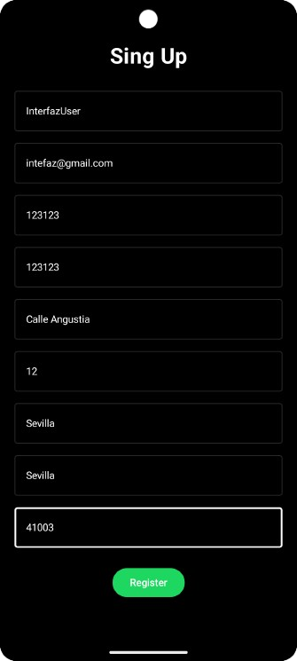
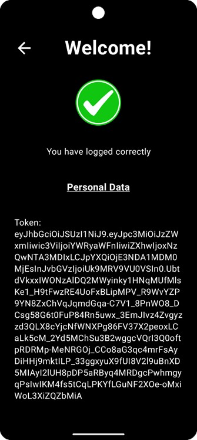

# Nombre del proyecto: Gestión Tareas del Hogar

# Descripción de los documentos y sus campos

## Documento Usuario

Representa a un usuario de la Aplicaión:

- id
- username
- email
- password
- role
- direccion

  ### SubDocumento Direccion

  Representa la Direccion de un Usuario:

  - calle
  - num
  - municipio
  - provincia
  - cp

## Documento Tarea

Representa una tarea en la Aplicación:

- id
- titulo
- descripcion
- estado
- usuario_id

# Endpoints

## Autenticación (Público)

- POST usuarios/register
- POST usuarios/login

## USER Y ADMIN

- GET /tareas
- GET /tareas/{id}
- POST /tareas
- PUT /tareas/{id}
- DELETE /tareas/{id}
- DELETE /tareas

# Decripción Endpoints

### Autenticación

Estos méotdos podrán ser accedidos por todos, sin excepcion de roles.

- POST usuarios/register -> Registra un usuario
- POST usuarios/login -> Inicia sesión devolviendo el token de autenticación

### USER Y ADMIN

| MÉTODO |        URI        |                       Descripción                       |
| :-----: |:-----------------:| :------------------------------------------------------: |
|   GET   |      /tareas      |     Obtener todas las tareas del usuario autenticado     |
|   GET   | /tareas{tareaId}  | Obtener una tarea mediante su ID del usuario autenticado |
|  POST  |      /tareas      |               Crear una nueva tarea propia               |
|   PUT   | /tareas/{tareaId} |         Editar una tarea propia mediante su ID.         |
| DELETE | /tareas/{tareaId} |        Eliminar una tarea propia mediante su ID.        |
| DELETE |      /tareas      |            Eliminar todas las tareas propias.            |

### ADMIN

| MÉTODO |                          URI                          |                                     Descripción                                    |
|:------:|:-----------------------------------------------------:|:----------------------------------------------------------------------------------:|
|   GET  |                     /admin/tareas                     |                   Obtener todas las tareas de todos los usuarios.                  |
|   GET  |           /admin/tareas/usuario/{ususarioId}          |                       Obtener todas las tareas de un usuario.                      |
|  POST  |           /admin/tareas/usuario/{usuarioId}           |             Crear una nueva tarea a un usuario concreto mediante su ID.            |
|   PUT  | /admin/tareas/{tareaId}/usuario/{usuarioId}/completar |   Marca como hecha una tarea concreta de un usuario concreto mediante ambas IDs.   |
|   PUT  | /admin/tareas/{tareaId}/usuario/{usuarioId}/pendiente | Marca como pendiente una tarea concreta de un usuario concreto mediante ambas IDs. |
| DELETE |      /admin/tareas/{tareaId}/usuario/{usuarioId}      |       Eliminar una tarea concreta de un usuario concreto mediante ambas IDs.       |
| DELETE |           /admin/tareas/usuario/{usuarioId}           |          Eliminar todas las tareas de un usuario concreto mediante su ID.          |

# Lógica de negocio

Cualquier usuario va a tener acceso tanto al login como al register.
En cuanto al rol USER, unicamente va a poder ver, editar, marcar como hecha, eliminar o añadir una tarea si es suya propia.
El rol ADMIN, podra hacer todo lo anterior, pero de cualquier otro usuario, no solo del suyo propio, exceptuando editar una tarea de otro usuario.
También podra ver todas las tareas en general o todas las tareas de un usuario en concreto.

# Excepciones y códigos de estado

|       Excepción       | Codigo estado HTTP |                                                                        Descripción                                                                        |                                                  Mensaje                                                  |
| :--------------------: | :----------------: | :---------------------------------------------------------------------------------------------------------------------------------------------------------: | :--------------------------------------------------------------------------------------------------------: |
|  BadRequestException  |        400        | Se lanza cuando la solicitud realizada por el cliente es incorrecta o no válida, como cuando faltan parámetros obligatorios en el cuerpo de la solicitud. |                      Bad request exception (400). + El mensaje concreto de cada caso                      |
|   NotFoundException   |        404        |                                                    Se lanza cuando no se encuentra un recurso solicitado                                                    |                        Not Found Exception (404).+ El mensaje concreto de cada caso                        |
|   ConflictException   |        409        |                         Se lanza cuando se intenta crear o modificar un recurso que entra en conflicto con un recurso ya existente                         |                        Conflict Exception (409). + El mensaje concreto de cada caso                        |
| AlreadyExistsException |        409        |                         Se lanza cuando se intenta crear o modificar un recurso que entra en conflicto con un recurso ya existente                         |                        Conflict Exception (409). + El mensaje concreto de cada caso                        |
| UnauthorizedException |        401        |                   Se lanza cuando el usuario no está autenticado o no ha proporcionado credenciales válidas para acceder a un recurso.                   |                      Unauthorized Exception (401). + El mensaje concreto de cada caso                      |
|   ForbiddenException   |        403        |                      Se lanza cuando el usuario no tiene permisos suficientes para acceder a un recurso, incluso si está autenticado.                      |                       Forbidden Exception (403). + El mensaje concreto de cada caso                       |
|  InternalServerError  |        500        |      Se lanza para capturar cualquier otro tipo de error no controlado por las excepciones anteriores. Esto puede ser un error de servidor inesperado.      | InternalServerError (500). An unexpected error ocurred (o algun otro personalizado en algun caso concreto) |

# Restricciones de seguridad

Se aplicará las siguientes restricciones:

- Autenticación con JWT para la identificación de usuarios.
- Hashing de contraseñas mediante bcrypt.
- Roles y permisos para restringir acciones.
- Validación de datos para evitar inyecciones y errores.

# Pruebas gestión usuarios

### Register

##### Registro correcto

- Registro desde insmonia USER

- Registro desde insmonia ADMIN

- Registro desde interfaz (USER por defecto)

- Inserción en MongoDB de los diferentes usuarios

##### Excepciones registro
- Nombre de Rol incorrecto

- Nombre ya en uso / Correo ya en uso

- Provincia, municipio no encontrado

### Login

##### Login Correcto

- Login insomnia
  

- Login interfaz

##### Excepciones Login

- Credenciales incorrectas
